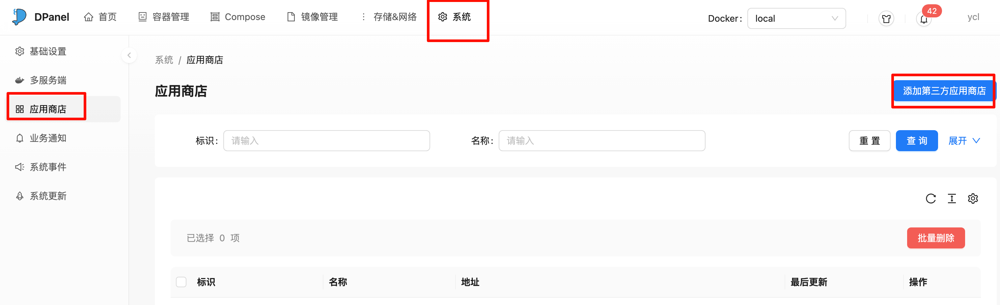
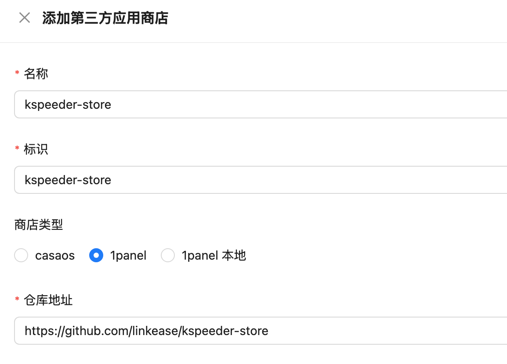
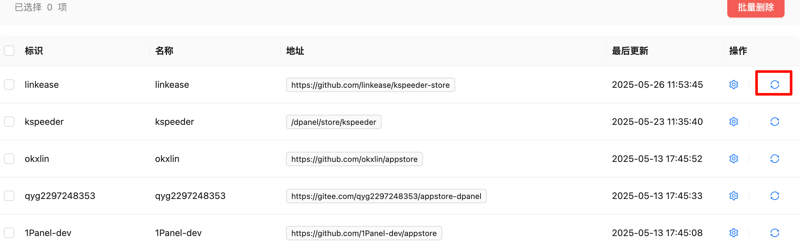
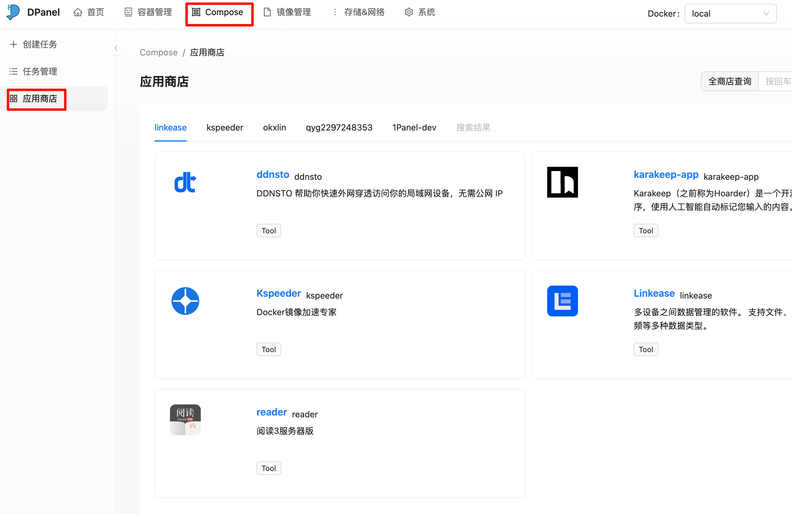
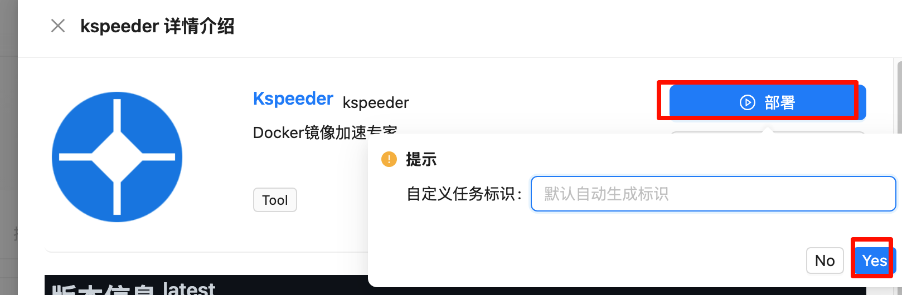
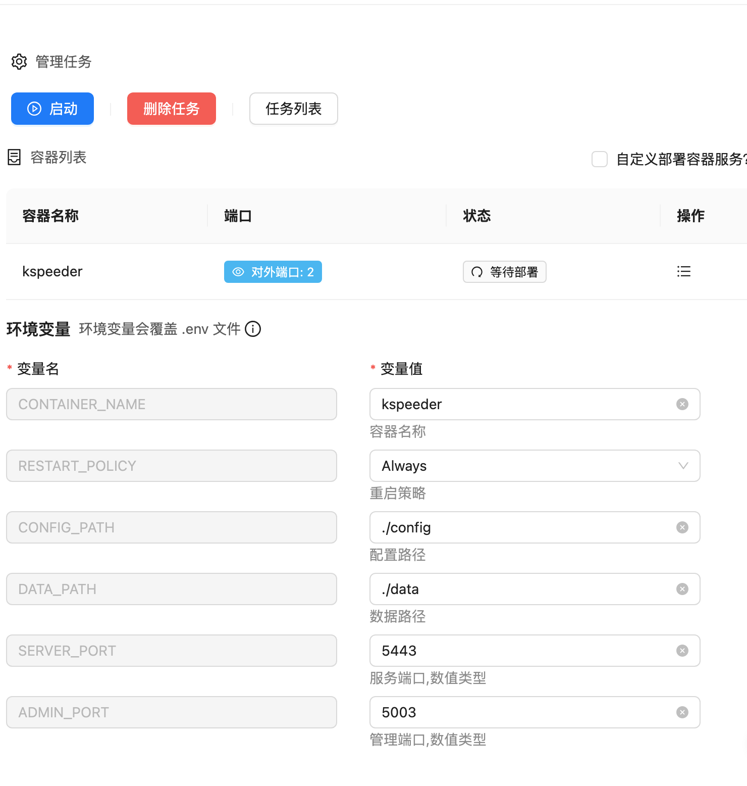
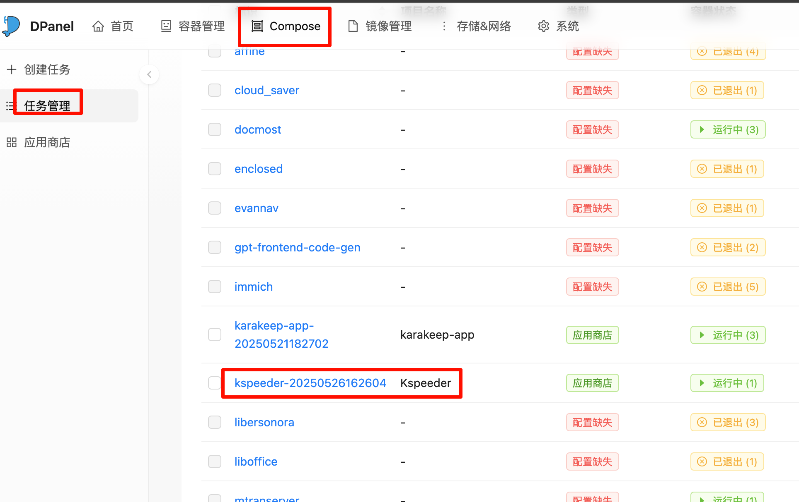
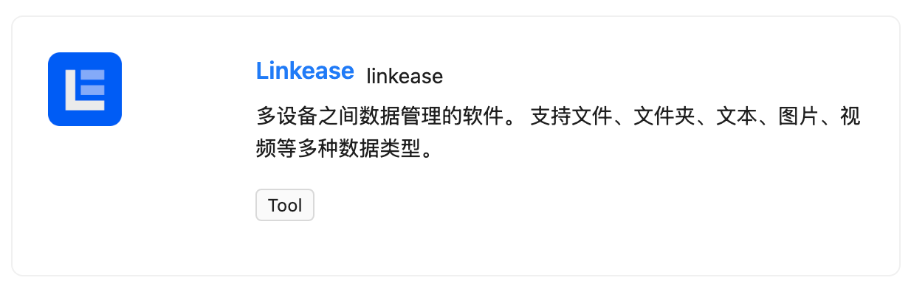
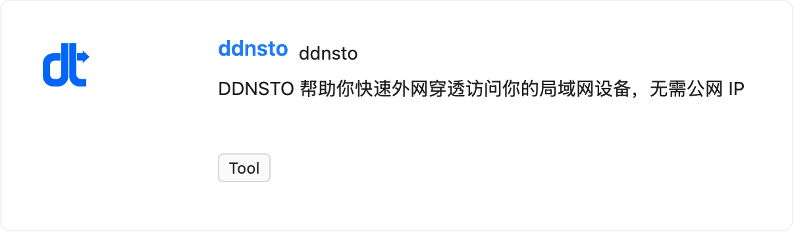

# KSpeeder-Store 使用指南：一键安装推荐容器

## 引言

想快速部署常用容器应用？KSpeeder-Store 是一个轻量级的容器应用商店，提供一键部署的便捷体验。它基于 DPanel 运行，支持通过图形界面浏览和安装推荐的容器镜像，大大降低了部署门槛，特别适合初学者和追求效率的开发者。

本文将手把手教你如何搭建 DPanel、配置 KSpeeder-Store，并通过它一键部署应用。

---

## 一、搭建 DPanel

KSpeeder-Store 运行在 [DPanel](https://github.com/donknap/dpanel) 之上，因此我们首先需要部署 DPanel。你可以使用以下 Docker 命令快速完成安装：

```shell
docker run -d --name dpanel --restart=always \
  -p 8807:8080 -e APP_NAME=dpanel \
  -v /var/run/docker.sock:/var/run/docker.sock \
  -v /home/dpanel:/dpanel dpanel/dpanel:lite
```

安装完成后，在浏览器访问 [http://127.0.0.1:8807](http://127.0.0.1:8807)，即可进入 DPanel 控制台。

---

## 二、添加 KSpeeder-Store 商店源

1. 进入 DPanel 控制台，点击左侧菜单栏中的“系统” → “应用商店”；

2. 在“商店源地址”中添加以下地址：

```shell
https://github.com/linkease/kspeeder-store
```


3. 添加完成后，点击右上角的“刷新”按钮以获取最新的商店应用列表。



---

## 三、从商店安装容器镜像

添加成功后，你将在商店页面看到多个推荐应用，如 KSpeeder 等。

1. 找到你想安装的容器，例如“KSpeeder”，点击 **部署**；
2. 在弹出的确认框中点击 **Yes**，进入配置页面；


---

## 四、配置并启动 KSpeeder 容器

1. 在配置页面中，可根据需求修改容器参数，例如端口映射、卷挂载路径等；
2. 配置完成后，点击 **启动**，系统将自动拉取镜像并部署容器；



3. 安装成功后，你将看到容器状态为“运行中”：



---

## 后续

可以试试我们的其他软件：

[易有云 (私人云盘)](https://www.linkease.com/)



[DDNSTO （快速内网穿透）](https://www.kooldns.cn/)



[KSpeeder （docker镜像加速并发下载）](https://kspeeder.com/)


---

## 参考资料

* DPanel 项目地址：[https://github.com/donknap/dpanel](https://github.com/donknap/dpanel)
* KSpeeder-Store 仓库：[https://github.com/linkease/kspeeder-store](https://github.com/linkease/kspeeder-store)

